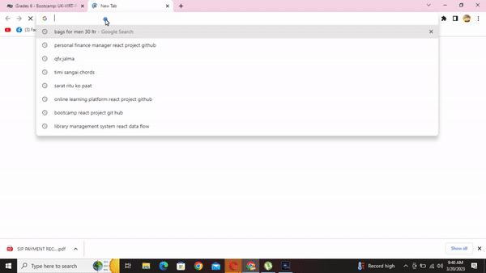

# work-scheduler
Easy manage access your work according with time frame

# Project Description
This website application is a straightforward daily planner intended to assist users in planning their workdays.

According on whether the time is in the past (RED), present (Green), or future(yellow), each time-block is color-coded (yellow). By entering text in a time block and then clicking the save button, users can save events. The same method can be used to delete events by deleting text and then saving.

# Technology Used

1.JavaScript

2.jQuery

3.moment.js

4.HTML

5.CSS

# Deployed Link:https://ajinthapa2000.github.io/work-scheduler/

# Project live record

